# 📋 TaskFlow

TaskFlow is a Full Stack Task Management Web Application that helps users organize and manage daily tasks efficiently.

---

## 🚀 Features

- 🔐 User Registration & Login
- 🔒 JWT Authentication
- 🔑 Password Hashing using bcrypt
- ➕ Add Tasks
- 📋 View Tasks
- ✏️ Update Tasks
- 🗑️ Delete Tasks
- 📊 Dashboard
- ✅ Completed & Pending Tasks
- 🔥 Priority Wise Tasks
- 🔍 Search Tasks
- 👤 User Profile
- 🔄 Change Password
- ❌ Delete Account

---

## 🛠 Tech Stack

### Backend
- Python
- FastAPI
- PostgreSQL
- JWT Authentication
- bcrypt

### Frontend
- HTML
- CSS
- JavaScript

---

## 📂 Project Structure

```text
TaskFlow
│
├── Backend
│   ├── main.py
│   └── requirements.txt
│
├── Frontend
│   ├── Login.html
│   ├── Register.html
│   ├── content.html
│   ├── Login.js
│   ├── Register.js
│   ├── content.js
│   ├── content.css
│   ├── task_manager.css
│   └── images
│
├── README.md
└── .gitignore
```

---

## ⚙️ Installation

Clone the repository

```bash
git clone https://github.com/Anil-Rasuri/TaskFlow.git
```

Go to backend

```bash
cd Backend
```

Install dependencies

```bash
pip install -r requirements.txt
```

Run the server

```bash
uvicorn main:app --reload
```

Open the frontend

```
Frontend/Login.html
```

using Live Server.

---


## 📸 Screenshots
### Register Page

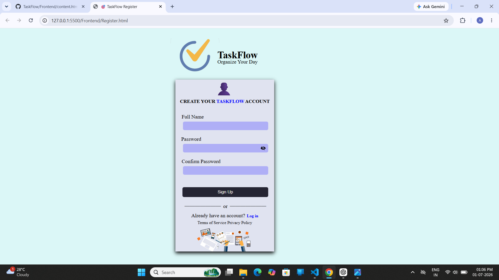

---

### Login Page

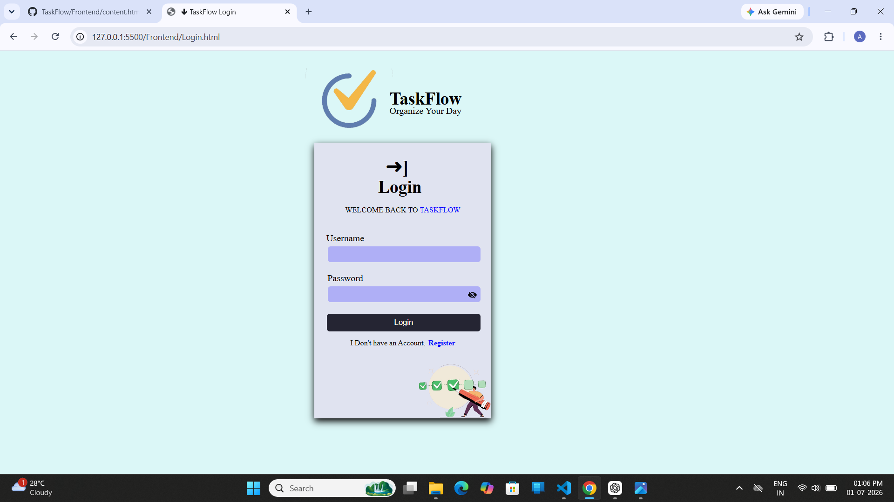

---

### Dashboard

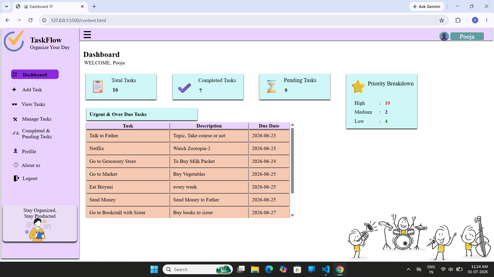

---

### Add Task

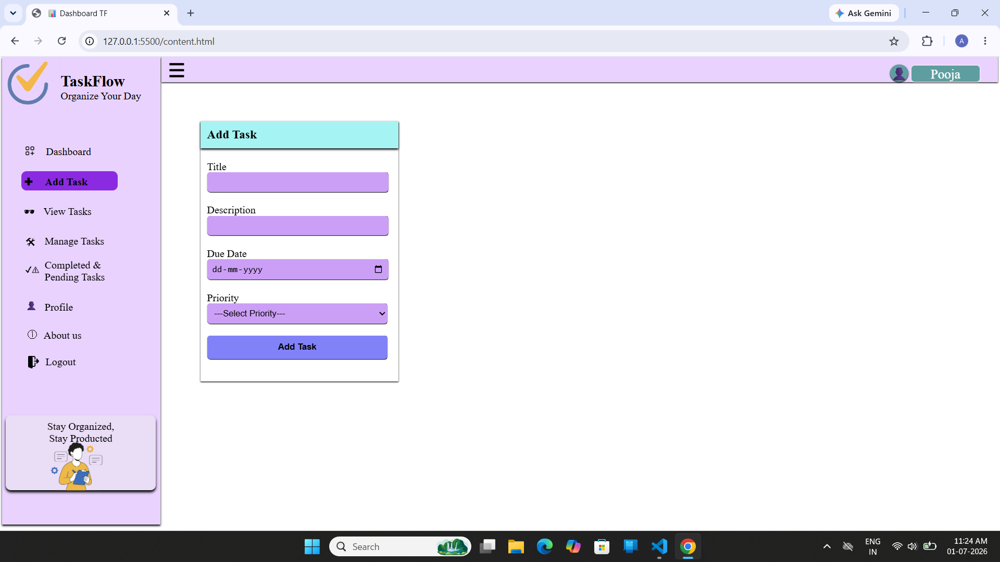

---

### View Tasks

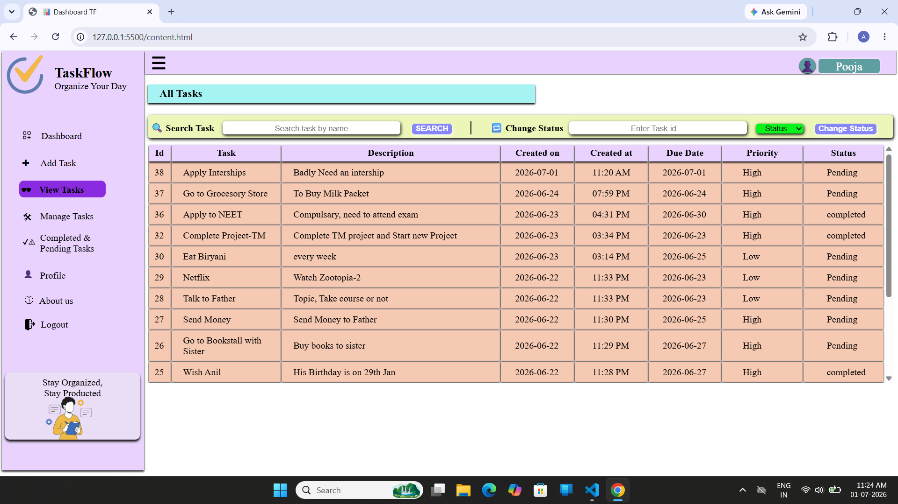

---

### Profile

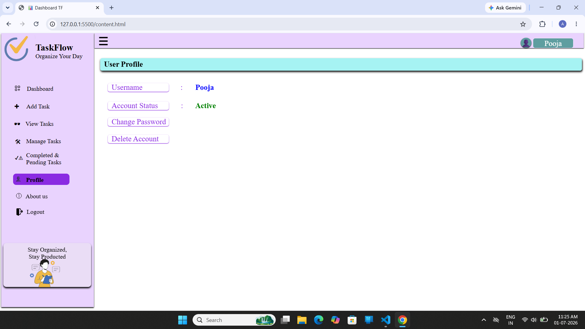

---

### Search Task

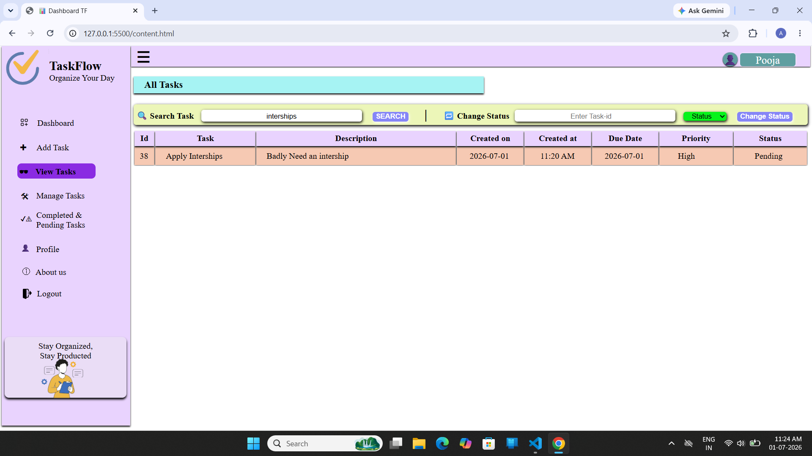

---

### About Us 

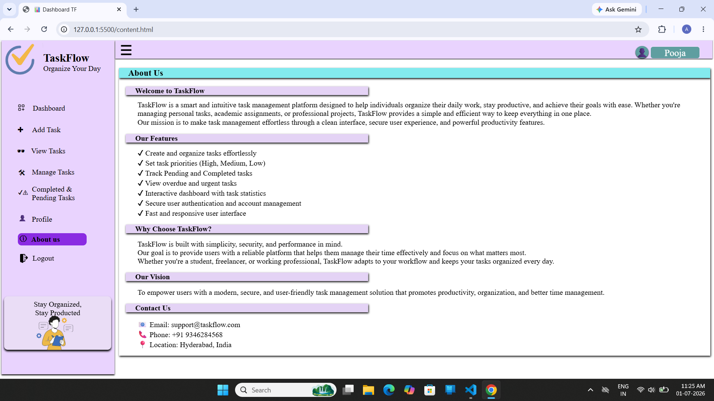

---

### Completed & Pending Tasks

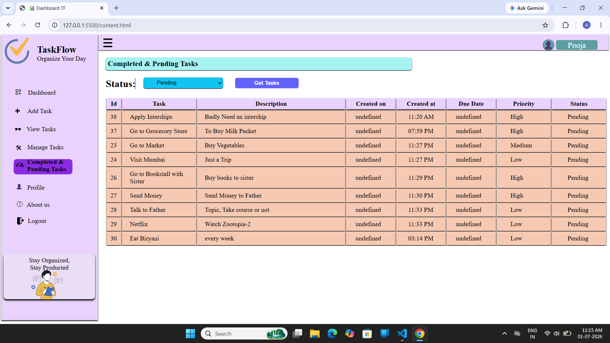

---
### Change Password

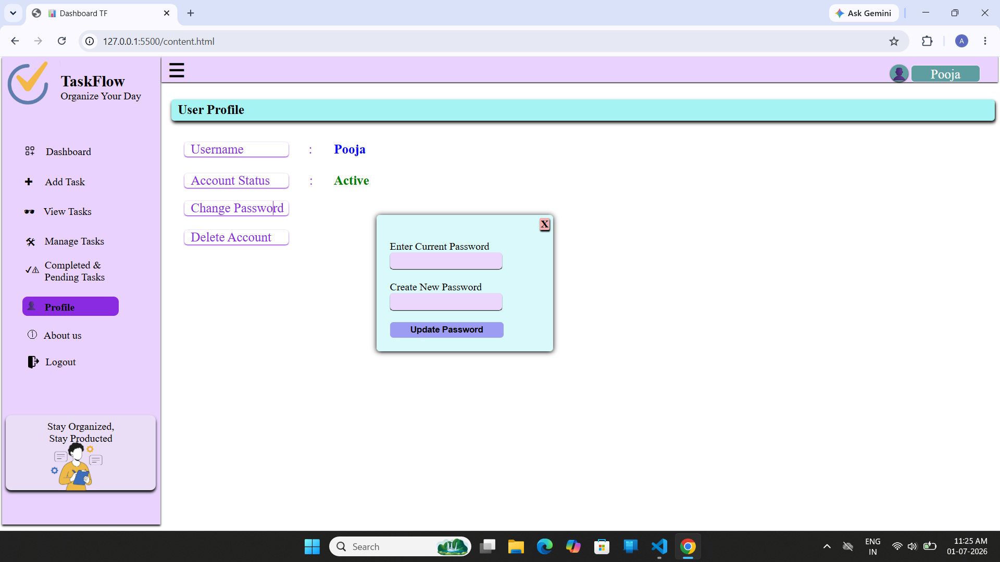

---
### Delete Account

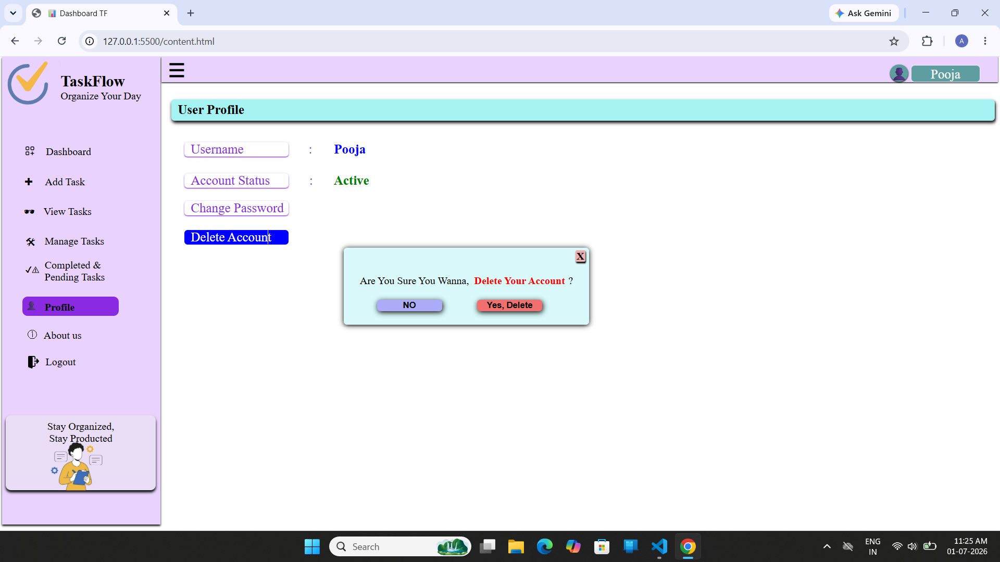

---
### Delete Task

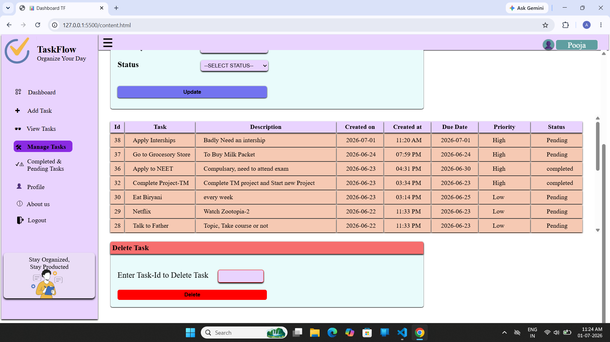

---
### Edit Task

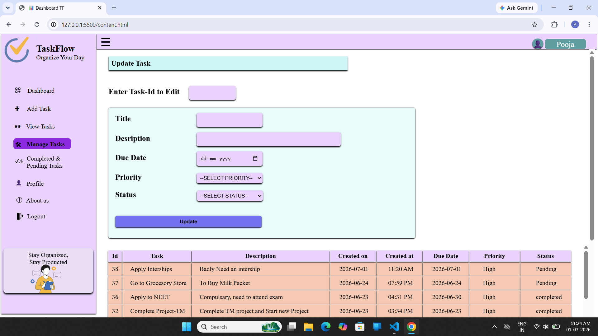

---

## 👨‍💻 Author

**Anil Rasuri**

GitHub:
https://github.com/Anil-Rasuri